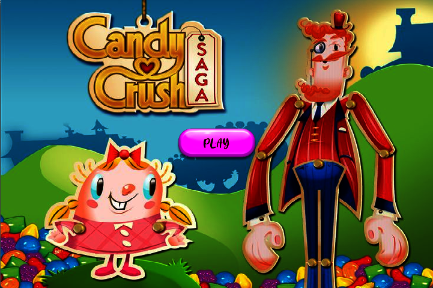

# 🍭 Candy Crush Saga (모작 프로젝트)

## 🎯 프로젝트 목적
- **DirectX 2D**와 **Windows API**를 활용한 그래픽스 및 윈도우 프로그래밍 기초 학습을 위해 제작한 모작 프로젝트입니다.
- 상업적 목적 없이 개인 학습과 포트폴리오 용도로만 제작되었습니다.

## ⏱ 개발 기간
- 2025년 3월 ~ 2025년 4월 (약 4주)

## 💻 개발 환경
- 운영체제: Windows 10
- 언어: C++
- 프레임워크: Windows API, DirectX 9 (2D 사용)

## 🛠 개발 도구
- Visual Studio 2022
- GitHub
- Photoshop

---

※ 본 프로젝트는 개인 학습을 위한 모작이며, **King**의 정식 게임인 *Candy Crush Saga*와는 무관합니다.
